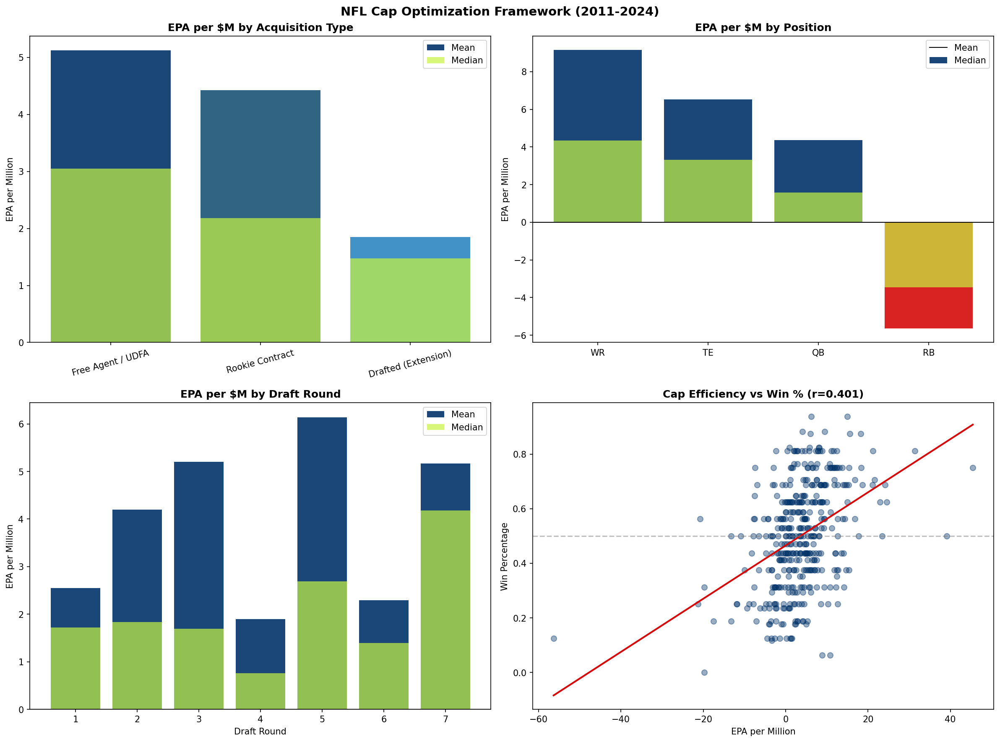
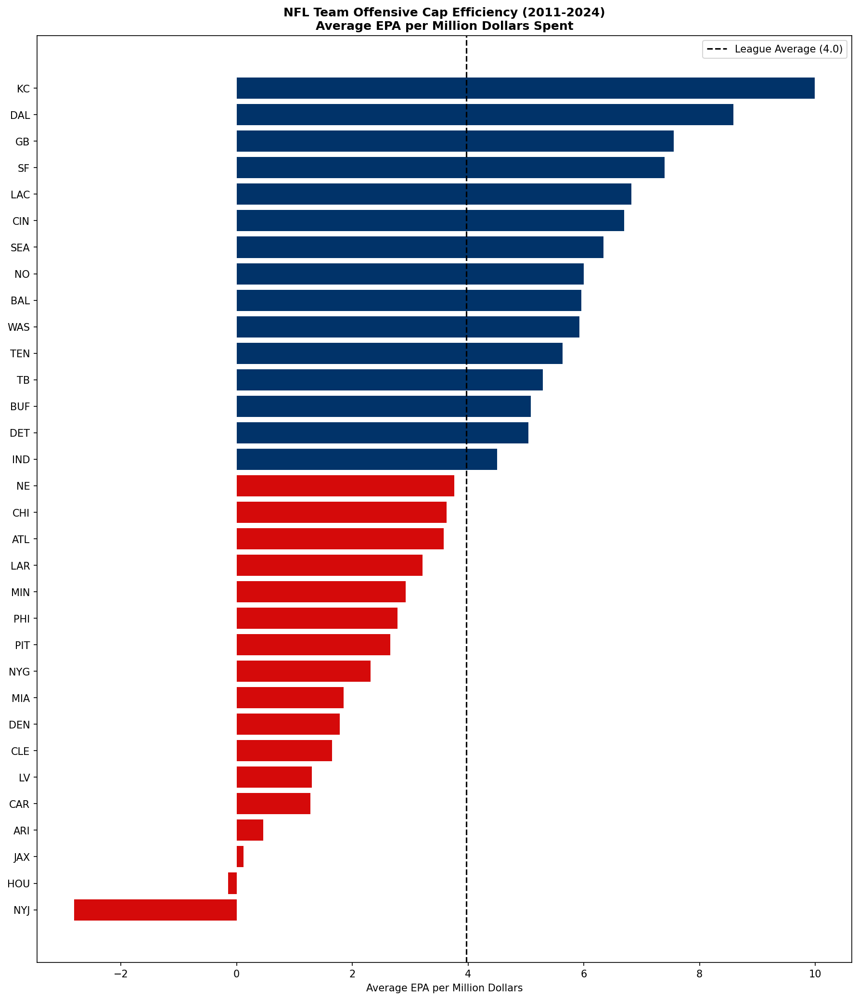
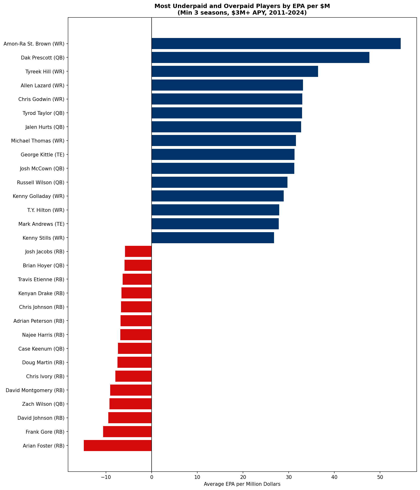
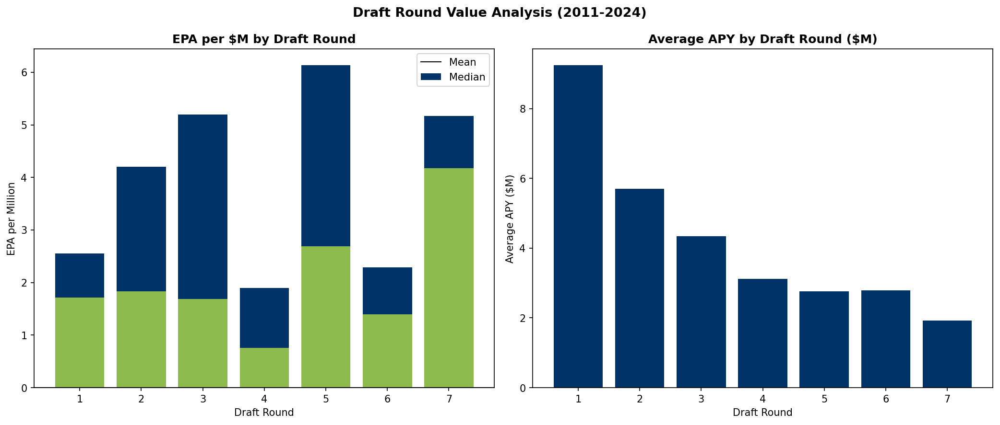

# NFL Salary Cap Analysis

## Overview
This project analyzes NFL salary cap efficiency — identifying which teams, positions, and acquisition methods produce the most on-field value per dollar spent. Using contract data from Over The Cap and performance data from nflverse across 46,608 contracts and 5,783 offensive player-seasons (2011-2024), we build a comprehensive framework for evaluating roster construction decisions through a cap efficiency lens.

## Key Findings
- **It's not where you spend, it's how efficiently you spend** — positional cap allocation has near-zero correlation with winning; EPA per million has a 0.401 correlation with win percentage
- **Rookie contracts generate 12x more EPA per dollar than extensions** — the single most important finding for cap management, with an average efficiency drop of 12.36 EPA per million from rookie deal to extension
- **Never pay running backs** — negative EPA per million at every price point, every year from 2011-2024 without exception. The most consistent finding in the dataset
- **Kansas City Chiefs are the most cap-efficient offense** — 9.99 EPA per million across 179 player-seasons, driven by Mahomes and smart surrounding contracts
- **New York Jets are the least cap-efficient** — negative EPA per million reflecting years of poor QB investment
- **The Deshaun Watson contract is the worst in modern NFL history** — $92M estimated dead cap, the most catastrophic guaranteed contract structure ever signed
- **WR under $5M is the best value in football** — +6.78 EPA per million driven by rookie deals and cheap veteran contracts
- **Round 5 is the most cap-efficient draft round** — players cost under $3M APY but occasionally produce elite value
- **Round 1 is the least cap-efficient round** — high cost rookie deals and massive extensions combine to drag down efficiency despite elite production
- **Amon-Ra St. Brown is the most underpaid player** — +54.53 EPA per million across 4 seasons

## Methodology
- **Contract data:** nfl_data_py `import_contracts()` — 46,608 contracts from 2011-2025
- **Performance data:** nfl_data_py `import_seasonal_data()` — linked via gsis_id to contracts
- **Defensive data:** nfl_data_py `import_snap_counts()` — snap percentage as defensive value proxy
- **Primary metric:** EPA per million dollars of APY
- **Acquisition classification:** Rookie contract, drafted extension, free agent/UDFA
- **Team analysis:** Offensive EPA efficiency linked to win percentage via schedule data

## Repo Structure
```
nfl-salary-cap-analysis/
├── data/
│   ├── raw/              # Raw data files (not tracked)
│   └── processed/        # Cleaned datasets (not tracked)
├── notebooks/
│   ├── 01_data_exploration.ipynb
│   ├── 02_contract_value.ipynb
│   ├── 03_team_efficiency.ipynb
│   ├── 04_dead_cap.ipynb
│   ├── 05_draft_vs_fa.ipynb
│   └── 06_cap_optimization.ipynb
├── outputs/
│   └── figures/
├── src/
├── requirements.txt
└── README.md
```

## How to Run
1. Clone the repo
2. Install dependencies: `pip install -r requirements.txt`
3. Run notebooks in order: `01 → 06`
4. Data downloads automatically in notebook 01

## Visualizations Preview









## Data Sources
- Contract data: [nfl_data_py](https://github.com/nflverse/nfl_data_py) via Over The Cap
- Performance data: [nfl_data_py](https://github.com/nflverse/nfl_data_py) via nflverse